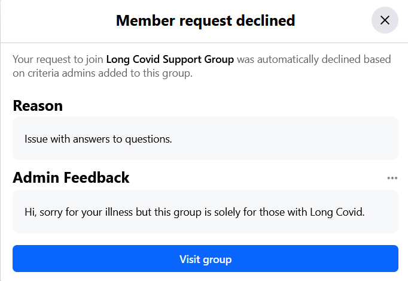

There are quite a number of labels people use for the name of their chronic illness. On this page, I discuss some of the ones I encounter the most as well as some of my own. Why do I care about labels? For a few reasons:

1. For better or worse, labels are used as a rallying cry to try to get governmental (and other) organizations to conduct research on the illnesses. I may still benefit from research done for a label that doesn't apply to me, but it seems less likely because the people doing that research would be fundamentally confused about what sort of disease they are even studying.
2. Labels are used to exclude people (see example below of a Facebook group that rejected my request to join because my post-viral illness wasn't from COVID). If some conditions are "more similar than different", then using labels that exclude some people will unfairly prevent people from accessing resources such as care/support, money, knowledge, etc.
3. Labels are handy for quickly communicating to others what I am dealing with. It's sadly not possible to have nuanced communication all the time, so having a quick-but-accurate label allows me to communicate the most important information quickly.

And now, here's the list of labels:

- **long-COVID**: I don't like this one because I think my own illness wasn't due to COVID (at the very least, not the first one that happened in April/May 2019; it's possible I had asymptomatic exposure to COVID or some sort of vaccine injury later on), but rather some other virus. It's clear at this point that while COVID causes a lot of long-term illness, there are tons of other people who are ill from other viruses or even things that are not a virus (such as bacteria and mold). At the moment, it's not clear to me (nor I think the rest of the world) how unique COVID is in terms of causing long-term illness, and given that, I feel "long-COVID" should be a sub-label under some more generic post-viral or post-something illness. One Facebook group about long-COVID rejected my request to join because my post-viral condition isn't from COVID:
  
  This level of gate-keeping seems absurd to me and is one of the reasons I don't like the term "long-COVID". People with chronic illness should be supporting and sharing as much as possible, not gate-keeping based on which specific virus got you sick.
- **POTS**: This one feels more like a symptom than a label for the illness. I realize some people seem to just have POTS, without some traumatic event that caused it in the first place. In that case, I'm not sure what you would call it other than "POTS" or "dysautonomia". I'll also say that I like **orthostatic intolerance** better because while tachycardia is one of the main things that happens that makes it difficult to stand, at least for me, sometimes I don't have tachycardia but I still feel like it's too much effort to stay seated or standing. POTS/OI is also a symptom that showed up later for me (about 2--3 years into being chronically ill), so it's also not clear what label I should have used prior to developing POTS.
- **dysautonomia**: This one is more general that POTS/OI, and I like it more for that reason, because I have other dysautonomia symptoms such as inability to sweat from heat. But it's also kind of a vague term and I think doesn't give people a good idea of what is wrong.
- **MCAS**: I used to think I had MCAS after reading Lawrence Afrin's book, but now I am not sure. Antihistamines (xyzal, zyrtec, claritin, allegra) don't seem to do anything for me or cause weird side-effects, and mast-cell stabilizers (quercetin, cromolyn) seem to make me worse! And of course, testing doesn't clearly "prove" that I have MCAS. I don't get the very obviously-MCAS symptoms like being allergic to everything and having skin irritation. So it's not clear to me I even have MCAS, and for that reason I don't like using this label for myself.
- **autoimmunity**: This one might be good, except that in my case, I haven't been diagnosed with any particular autoimmune disease and it's not clear how big of a deal the autoimmune markers are. So it may not be an accurate label.
- **post-viral illness**: This one seems like the most accurate label for myself. But there are other illnesses like chronic Lyme disease and mold exposure that are similar and aren't caused by a virus (rather, bacteria, fungi).
- **post-something syndrome**: This one I just made up, but I like that it conveys a sense of "yeah, no one knows what is going on with this disease".
- **ME/CFS**: I feel a bit excluded when people use this term because while I do have less energy/stamina (both mental and physical), and sometimes have "fatigue" that causes me to lie down and nap, fatigue is not my biggest complaint (it's probably about the 10th most severe symptom that I have). I also don't seem to experience post-exertional malaise, which is the hallmark symptom of ME/CFS. I realize ME/CFS forms some kind of cluster, and for people in that cluster it seems like a good term, but for people like myself who are not in that cluster, it feels exclusionary.

Conferences like "[UniteToFight](https://unitetofight2024.world/)" that brand themselves as being for "ME/CFS and Long COVID" exclude other conditions (including mine) that are more similar than different. There's a lot of weird politics going on here where the ME/CFS community built up this label and have been doing activism for years, but now that COVID is a thing, they've started labeling a lot of things (including the conference here) as being about "ME/CFS and Long COVID", so that they can jump on the "long COVID" bandwagon. Meanwhile, cases like mine don't even have an official diagnostic name!